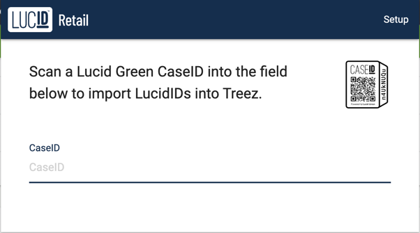
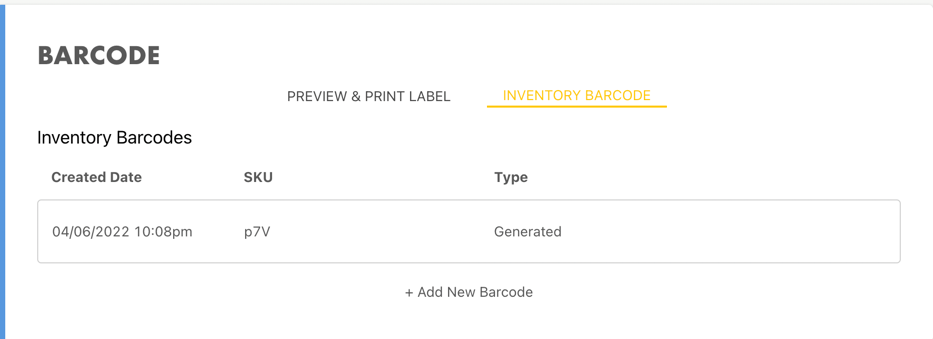
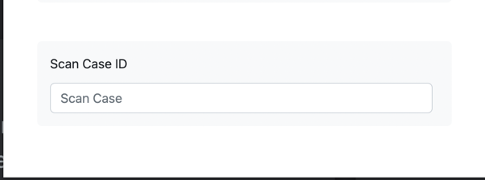

# Treez Chrome Extension

Automatically add scanned cases to the Treez console UUID using a Chrome addon

# How to install the extension locally
1. Navigate to the page where you manage Chrome extensions. chrome:/extensions/
2. Make sure the upper right corner has Developer mode selected.
3. Select the folder containing the source code by clicking Load unpacked on the left.
4. The extensions must be set up to work.

# How to start building the expansion.
1. Ensure that the client secret and client ID credentials are entered.
   
2. Access the Treez website's barcode area.
   
3. Make a UUID copy or scan of a case.
   
4. The extension will launch a list of lucid IDs in the barcode area.