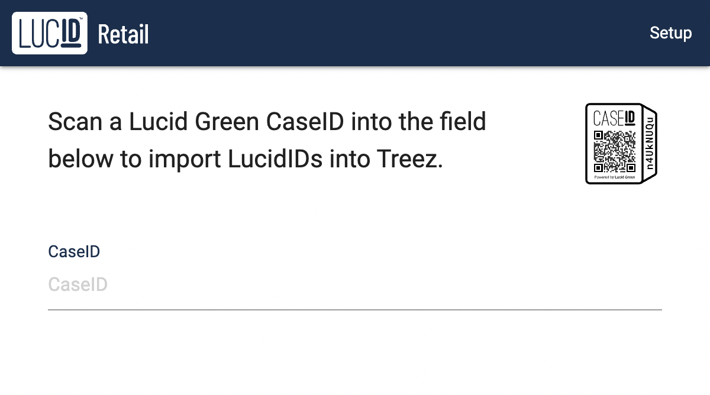

# Treez Chrome Extension

Automatically add scanned cases to the Treez console UUID using a Chrome addon

# Installing the Chrome Extension locally

1. Navigate to the page where you manage Chrome extensions. chrome:/extensions/
2. Make sure the upper right corner has Developer mode selected.
3. Select the folder containing the source code by clicking Load unpacked on the left.
4. The extensions must be set up to work.

--------------------------------------------------------------------------------

# Using extension in the browser

1. Ensure that the client secret and client ID credentials are entered.
   

2. Access the Treez website's barcode area.
   

3. Scan a case QR code or paste a case uuid
   

5. The extension will populate a list of lucid IDs in the barcode area.

--------------------------------------------------------------------------------

# Publishing the extension to web store

As we have the extension already published in the Chrome Web Store, we can simply publish it again without any
additional steps.
all you have to do is the following:

- Go to the [Chrome Web Store developer dashboard](https://chrome.google.com/webstore/devconsole).
- Click on the extension's name in the list of extensions
- Go to Package tab
- Upload a new zipped version of the extension containing all necessary files.
- Save draft
- Submit for review

# Developer and work Around modes Switching
- In background.js, change the value of the `workAround` variable to `true` or `false` to switch between the two modes.
- In background.js, change the value of the `dev_mode` variable to `true` or `false` to switch between the two modes.
